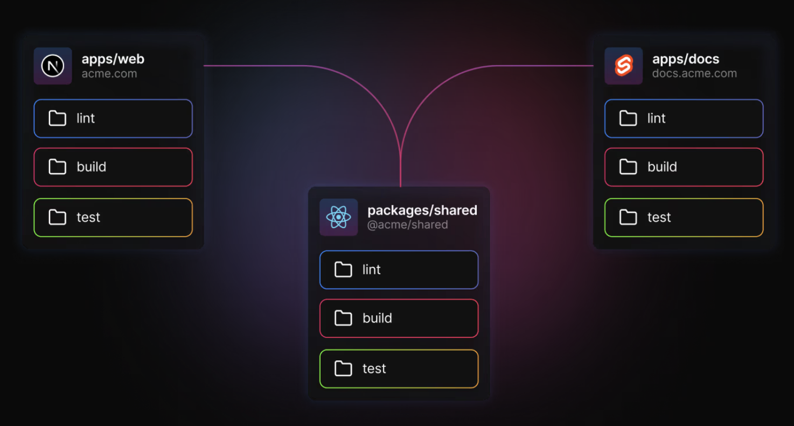

# Monorepo administrado con turborepo

# Creacion de un proyecto monorepo con turborepo
## Use an example listed below
1.-npx create-turbo@latest --example [example-name]
 
## Use a GitHub repository from the community
2.-npx create-turbo@latest --example [github-url]

## Arquitectura inicial de un monorepo -turborepo

# Creacion de un paquete interno
Los paquetes internos son los componentes básicos de tu espacio de trabajo y te ofrecen una forma eficaz de compartir código y funcionalidad en todo tu repositorio. 

