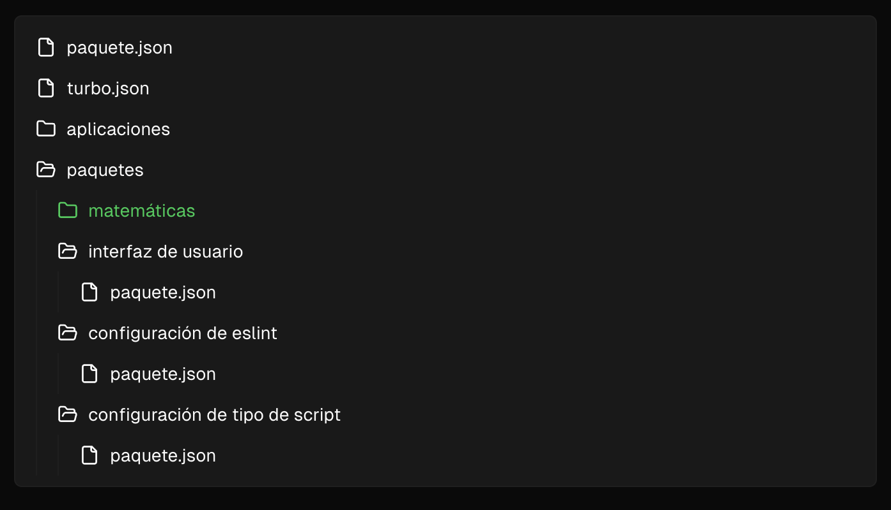

# Monorepo administrado con turborepo

# Creacion de un proyecto monorepo con turborepo

## Use an example listed below

1.-npx create-turbo@latest --example [example-name]

## Use a GitHub repository from the community

2.-npx create-turbo@latest --example [github-url]

## Arquitectura inicial de un monorepo -turborepo

# Creacion de un paquete interno

https://turborepo.com/docs/crafting-your-repository/creating-an-internal-package

Los paquetes internos son los componentes básicos de tu espacio de trabajo y te ofrecen una forma eficaz de compartir código y funcionalidad en todo tu repositorio.

# 1.-Crear un directorio vacío

Necesitarás un directorio para colocar el paquete. Creemos uno en ./packages/math.

# 2.-Agregar un paquete.json

A continuación, cree el archivo package.jsonpara el paquete. Al agregar este archivo, cumplirá con los dos requisitos de un paquete interno , haciéndolo visible para Turborepo y el resto de su espacio de trabajo:

Vamos a desglosarlo package.jsonpieza por pieza:

# 3.-Agregar un tsconfig.json

Especifique la configuración de TypeScript para este paquete agregando un tsconfig.jsonarchivo a la raíz del paquete . TypeScript tiene una extendsclave que le permite usar una configuración base en todo el repositorio y sobrescribirla con diferentes opciones según sea necesario.

{
"extends": "@repo/typescript-config/base.json",
"compilerOptions": {
"outDir": "dist",
"rootDir": "src"
},
"include": ["src"],
"exclude": ["node_modules", "dist"]
}

# 4.-Agregar un srcdirectorio con código fuente

# 5.- Agregar el paquete a una aplicación

"dependencies": {

- "@repo/math": "\*",
  "next": "latest",
  "react": "latest",
  "react-dom": "latest"
  },

# listo

@repo/mathAhora está disponible en la webaplicación

# 6.- Editar turbo.json

Agregue los artefactos de la nueva @repo/mathbiblioteca a la outputstarea builden [nombre del archivo] turbo.json. Esto garantiza que Turborepo almacene en caché sus resultados de compilación, de modo que puedan restaurarse instantáneamente al iniciar las compilaciones.

# 5 .-Correr npm install
# 7.- Correr turbo build

Si lo has instalado turboglobalmente , ejecútalo turbo builden tu terminal, en la raíz de tu espacio de trabajo. También puedes ejecutar el buildscript desde package.jsontu gestor de paquetes, que usará turbo run build.

El @repo/mathpaquete se crea antes de que webse cree la aplicación para que el código de tiempo de ejecución ./packages/math/distesté disponible para la webaplicación cuando se incluye.
